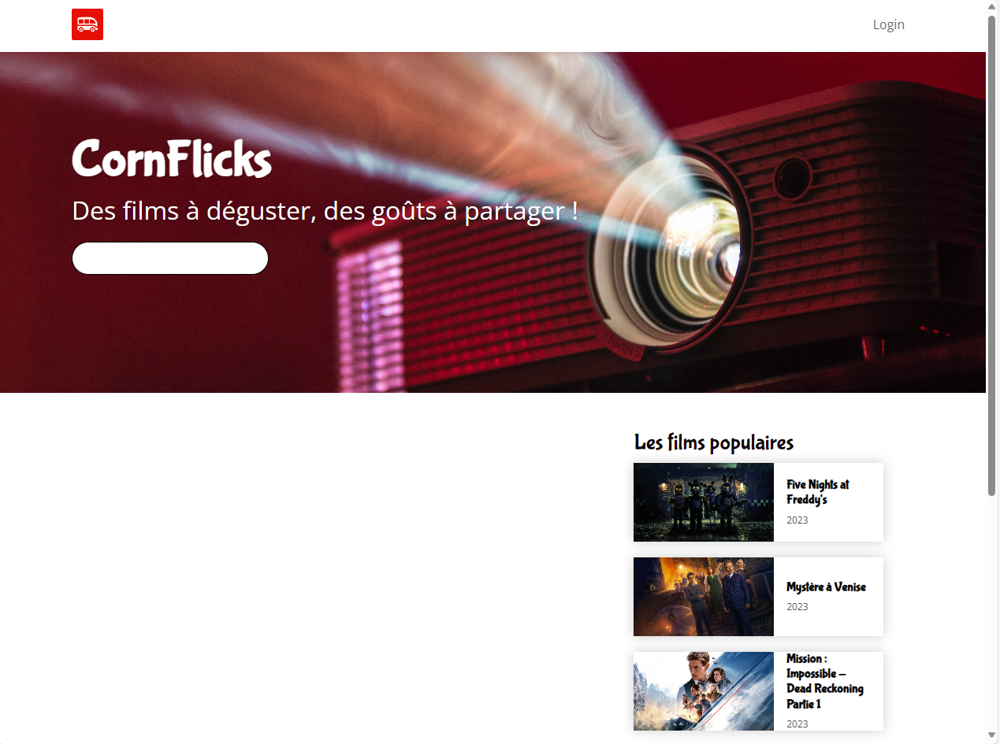
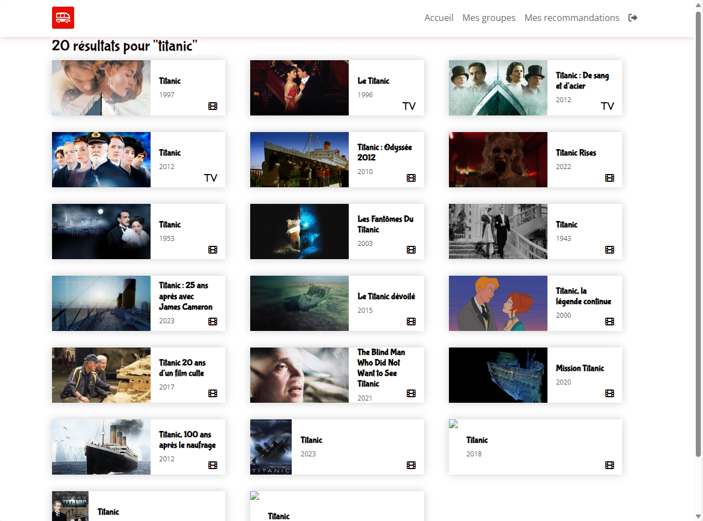
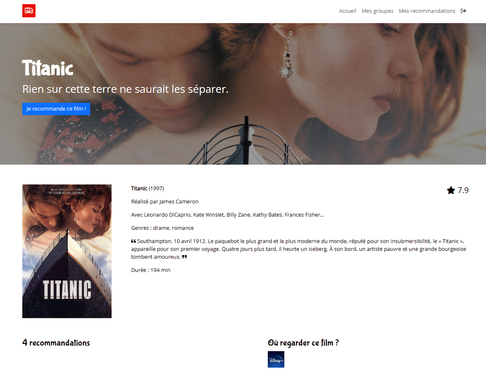
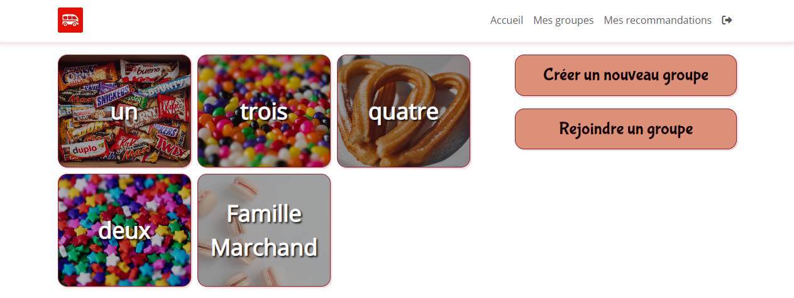

# CornFlicks

**Projet personnel en construction**

Ce site permet de regrouper et dynamiser les recommandations de films et de séries à son entourage.

## Fonctionnalités

- Chercher un film ou une série avec un mot-clé
- Consulter la fiche d'informations du média choisi
- Poster une recommandation pour un film ou une série
- Rejoindre des groupes communautaires (famille, amis, collègues...)
- Permettre à un utilisateur de rejoindre un groupe grâce à un code de partage unique

## Ce qui reste à faire

- Améliorer les pages d'informations sur les films ou séries
- Faire le front-end des formulaires (connexion, créer un groupe, recommander un média...)
- Développer la page des groupes où les recommandations sont listées
- Débugger lorsque l'API retourne des informations vides

## Utilisation d'une API

Pour ce site, j'utilise l'API **TMDB**

## Screenshots de l'application en cours de développement

